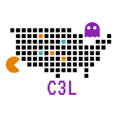
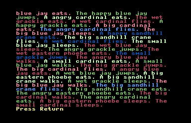
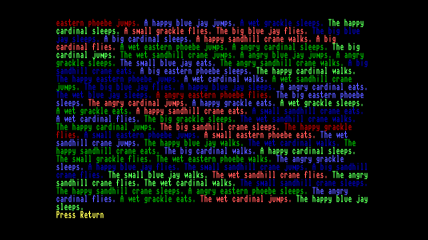
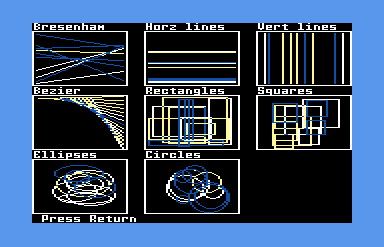
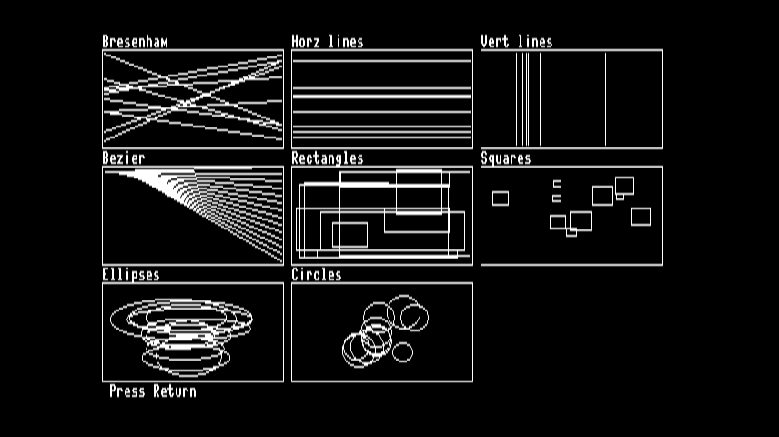
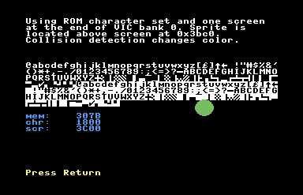
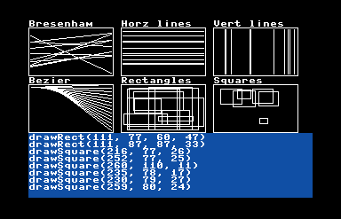

C3L, which stands for Commodore 128 CP/M C Library, is a contemporary API built upon the ANSI C standard. It is specifically crafted to streamline the utilization of C128 distinctive features within the CP/M environment.

I am often asked why I chose CP/M instead of the "native" Z80 mode. The origins of C3L are rooted in Turbo Pascal and ANSI C, dating back to the late 80s and early 90s. During that time, the code was actually developed on the C128 in CP/M mode. The advantages of using CP/M with Z88DK include more straightforward file I/O and the absence of a need for a BASIC loader. However, you can still build native applications with C3L that do not require file I/O or cpm.h. You will need to make the necessary adjustments yourself, as others have done over the years.

## Features snapshot
* Utilize modern Integrated Development Environments (IDEs) to develop code and identify syntax errors prior to compilation.
* High-performance abstraction layer for VDC and VIC text and bitmap modes, enabling the creation of dual monitor mixed-mode applications effortlessly.
* VDC printCon boasts 12 times faster speed, while VIC printCon achieves an 18 times improvement compared to standard CP/M output (C printf).
* VIC split-screen modes implementation using raster interrupt.
* VIC sprites are fully supported.
* Voice synthesis employing ARPAbet phonemes, with the flexibility to compile your customized voice library.
* Play 1, 2, and 4-bit RAW audio through the SID.
* SID functions provided for simplified sound programming.
* CIA precision timing and TOD clock functions.
* Enhanced keyboard input surpassing C128 CP/M standards, resolving any peculiar shift key issues.
* Seamless access to joysticks, paddles, and the 1351 mouse.
* All code tested on real hardware (special thanks to Donavon Szydlowski).

## Running demos
If you have VICE already setup you can run the demo applications using the [disk images](https://github.com/sgjava/c3l/tree/master/disks).
* `x128 -80col`
* In VICE configure drives
* Boot boot.d71 as device 8
* Attach demo.d71 as device 9
* Do a hard reset.
* `b`:
* `dualcon`
* To list all the demos just `dir *.com`
* demo.d71 is general demos
* graphics.d71 is graphics related
* talk.d71 voice synthesis 
* playpcm.d71 PCM sound related

It's best to log into drive B since programs will default to current drive for required files.

## Set up development environment
To enhance efficiency and standardize the development environment, I have adopted the following tools: Ubuntu 24.04 VM, Eclipse, Z88DK, VICE and ctools. This combination offers the most expedient approach for C development on the C128 CP/M platform. It is worth noting that you can also adapt this framework for your personal projects unrelated to C3L.

Within the "c3l/scripts" directory, you will find a file called "build.sh." This script builds the C3L library, compiles demos, exports
them, and ultimately creates new d71 disks.

#### Build [VICE](http://vice-emu.sourceforge.net)
* `sudo apt install git curl build-essential autoconf libgtk-3-dev libvte-2.91-dev libjpeg-dev libpng-dev libgif-dev libtiff-dev libxaw7-dev libxxf86vm-dev libaudio-dev libasound2-dev libpulse-dev libreadline-dev libudev-dev libusb-1.0-0-dev flex bison dos2unix xa65 libglew-dev texlive-full libcurl4-openssl-dev libswresample-dev libevdev-dev`
* `cd`
* `git clone --depth 1 https://github.com/VICE-Team/svn-mirror`
* `cd svn-mirror/vice`
* `./autogen.sh`
* `./configure`
* `make -j$(getconf _NPROCESSORS_ONLN)`
* `sudo make install`
* `x128 -80col`

#### Build [FFMPEG](https://ffmpeg.org) used for VICE video recording
* `cd`
* `mkdir .local/bin`
* `git clone --depth 1 https://github.com/markus-perl/ffmpeg-build-script.git`
* `cd ffmpeg-build-script`
* `nano build-ffmpeg` and change to `FFMPEG_VERSION=4.4`
    * Change `FFMPEG_VERSION=4.4`
    * Comment out `CONFIGURE_OPTIONS+=("--enable-libwebp")`
* `./build-ffmpeg --enable-gpl-and-non-free --build`
* `sudo cp ~/ffmpeg-build-script/workspace/bin/* /usr/local/bin/.`

#### Build ctools
* `cd`
* `git clone https://github.com/mist64/ctools`
* `cd ctools/src`
* `make`
* `make install`
* `sudo cp ../bin/* /usr/local/bin/.`

#### Build Z88DK
* `cd`
* `sudo apt install build-essential bison flex libxml2-dev subversion zlib1g-dev m4 ragel re2c dos2unix texinfo texi2html gdb curl perl cpanminus ccache libboost-all-dev libmodern-perl-perl libyaml-perl liblocal-lib-perl libcapture-tiny-perl libpath-tiny-perl libtext-table-perl libdata-hexdump-perl libregexp-common-perl libclone-perl libfile-slurp-perl pkg-config libgmp3-dev`
* `cpanm --local-lib=~/perl5 App::Prove CPU::Z80::Assembler Data::Dump Data::HexDump File::Path List::Uniq Modern::Perl Object::Tiny::RW Regexp::Common Test::Harness Text::Diff Text::Table YAML::Tiny`
* `eval $(perl -I ~/perl5/lib/perl5/ -Mlocal::lib)`
* `git clone  --recursive  https://github.com/z88dk/z88dk.git`
* `cd z88dk`
* `export BUILD_SDCC=1`
* `export BUILD_SDCC_HTTP=1`
* `export PKG_CONFIG_PATH="/usr/lib/x86_64-linux-gnu/pkgconfig"`
* `chmod 777 build.sh`
* `./build.sh`

#### Build cc1541
We'll use this to copy files to/from non-CP/M disk images.
* `cd`
* `git clone https://bitbucket.org/ptv_claus/cc1541.git`
* `cd cc1541`
* `make all`
* `sudo cp cc1541 /usr/bin/.`

## Building C3L project
For command line.
* `cd`
* `git clone https://github.com/sgjava/c3l.git`
* `cd ~/c3l/scripts`

For Eclipse File, Import..., Git, Projects from Git, Clone URL, https://github.com/sgjava/c3l.git.
* `cd ~/eclipse-workspace/c3l/scripts`

Then
* `./build.sh`

## Programming considerations

No range checks are performed by most functions for performance sake. It is
incumbent upon the programmer to handle range checks. If you go out of range
and corrupt the program or OS memory it will most likely lock the machine.

Manage stack and heap sizes yourself instead of using any automatic methods.

Set stack size:

```
#pragma output CRT_STACK_SIZE = 1024
```

Only set heap if you need to reserve memory for TPA uses like VIC memory mapping:

```
// Protect VIC memory < 0x8000
#pragma output CRT_HEAP_ADDRESS = 0x8000
```

See [Classic Pragmas](https://github.com/z88dk/z88dk/wiki/Classic--Pragmas)

## High performance character mode

 

[Screen](https://github.com/sgjava/c3l/blob/main/include/screen.h) provides an 
abstraction that blows the doors off standard CP/M since it doesn't rely on MMU bank 
switching. If you do not use color printing it's even faster. A common color scheme 
is used and mapped by the various functions. This allows portability between VIC and 
VDC. Of course all of these settings are mutable at runtime.

If you see a color flicker in color scroll it's due to scrolling character and color memory
separate from each other. i.e. all characters are scrolled then all colors. This allows you
not to use the color scroll and improve performance. Later, it might make sense to do
character and color scroll at same time to reduce this at the cost of performance.

#### Features
* Use ROM character set at 0x1800 for the smallest memory footprint (VIC)
* Fast print uses existing background color
* Fast color printing too
* PETSCII print functions convert from ASCII strings to PETSCII
* Custom character sets (can be copied from VDC or loaded from disk)
* Scroll any area of screen

## Basic console
If your app requires more of a console abstraction then use [console](https://github.com/sgjava/c3l/blob/main/include/console.h).
It operates like a normal console keeping track of the cursor and scrolling. There 
is also a print function that allows word wrapping.

#### Features
* Basic cursor (defaults to off)
* Fast print uses existing background color
* Fast color printing too
* Fast word wrap printing
* Automatic scrolling

## High performance bitmap graphics

  

[Bitmap](https://github.com/sgjava/c3l/blob/main/include/bitmap.h) provides an 
abstraction for common graphic functions.

#### Features
* Set pixel function allowing pixel color (for monochrome 1 to set and 0 to clear)
* Fast color and bitmap clearing
* All drawing functions can use pixel color
* Optimized line drawing uses accelerated horizontal and vertical line functions
before using Bresenham's algorithm
* Rectangle uses optimized horizontal and vertical line functions
* Square (aspect ratio correct)
* Bézier curve
* Ellipse
* Circle (aspect ratio correct)
* Use existing character set to print to bitmap

## 8564/8566 VIC-IIe

 

### Features
* Easy to configure VIC mode and memory layout
* Character and bitmap mode options galore
* Sprites
* Split screen using raster IRQ

### VIC memory management in CP/M
By default CP/M uses the VIC in MMU bank 0. This makes it difficult to access
from your CP/M program because the TPA is in bank 1. You could try to switch
banks like CP/M does, but this is very inefficient. Plus there is very little
free RAM in bank 0 that you could leverage. For C3L programs MMU bank 1 is
used and your program manages the VIC's memory.

There are several configurations you can
use based on program size and VIC features you want to use. The simplest
configuration is to have your program and VIC memory in VIC bank 0.
With this configuration your program can reside from
0x100-0x2fff (almost 8K) and VIC memory is used starting at 0x3000 for character
set and 0x3800 for first screen. 0x1000-0x1fff is viewed by the VIC as
character ROM, but your program can use this memory, so it's not wasted.
0x9000-0x9fff in bank 2 is also considered character ROM.

### How to rip sprites and create loadable libraries
To make life simple I'll show one way to rip sprites from C64 games. In this example we'll use
Action Replay v6 cartridge and Wizard of Wor disk. The sprite demo expects 12 sprites in the
following sequence. Three sprites for left, right, up and down or 12 sprites total. This is how
we will save them off and build a single sprite library file.
* `cd ~/eclipse-workspace/c3l/resources/sprites`
* `cc1541 sprites.d64`
* `x64`
    * Preferences, settings, Peripheral devices, Drive, Drive 9, CBM 1541-II, Close
    * File, Attach disk image..., Deive #8, wow.d64
    * File, Attach disk image..., Deive #9, sprites.d64
    * File, Attach cartridge image..., action_replay_6.crt, press F3
    * load "*",8,1
    * run
    * Alt+Z
    * V to view sprites
    * Use < and > to navigate
    * S to save (make sure you use device 9 which is your sprite disk)
    * A to continue
    * Enter name
    * Press space
* Continue until you save all the sprites you want to make a library with
* `cc1541 -X "*" sprites.d64` 
* `cd ~/eclipse-workspace/c3l/scripts`
* `./sprites` to build sprite libraries
 
### Return to CP/M mode
You should return to CP/M like nothing happened to the VIC.

### Limitations
As I mentioned above 0x1000-0x1fff and 0x9000-0x9fff are always read by the VIC as character ROM. Your
program will still use this memory normally.

### Character mode
I include everything you need to take control of character mode. I
also included PETSCII print functions, so you can use the ROM character set
at 0x1000-0x1fff or 0x9000-0x9fff (VIC bank 0 and 2). To keep things consistent
I like to use the VDC's character set since that's what you use in normal CP/M
mode. You have to think a little different using C3L since stdout is no longer
visible. stdout still goes to the screen in VIC bank 0, so that could be used
for debugging, etc.

### Bitmap graphics
I put some thought in how to share the same graphics functions across the VIC
and VDC (DRY principle). In an OOP language like Java you'd just use an
interface and create various implementations. Since I'm using ANSI C I had to
go with function pointers. This basically allows runtime polymorphism, thus I
can set the pixel routines, etc. at runtime and share the graphics functions.

I took a fresh look at implementing lines, rectangles, ellipses and circles.
setPixel sets a pixel. I added color to the function to make it set or clear pixels
(for monochrome). This is pretty cool, since you can easily erase parts of your
drawing using the same parameters except color. Set color to 1 to set and 0 to
clear pixels. As I add new color modes the color argument will be able to
handle it.

I optimized drawLine by detecting horizontal and vertical lines. drawLineH
can draw horizontal lines about 15x faster than Bresenham's algorithm based on
the bitmap memory layout and not having to read/write the pixel byte 8 times like
setPixel. drawLineV is optimized also, but not nearly as much
as drawLineH. You can still call drawLineH and drawLineV directly as needed.

Enough bitmap graphic basics are provided to build applications that can graph
data, build out game screens, annotate with text that can have unique foreground
and background colors, etc.

## 6581/8580 SID
All the required functions are there to drive the SID.

### Features
* Clear SID
* Set master volume
* Set envelopes
* Set attack/release cycles
* Set pulse wave
* Play 1, 2 and 4 bit raw PCM files
* Voice synthesis employing ARPAbet phonemes

How to create you own 4 bit PCM files. After installing programs download an mp3 from Youtube video, 
convert 10 seconds of mp3 to 8 bit PCM snd file, move to CP/M disk image and finally convert to 4 bit raw.
* `sudo apt install yt-dlp sox libsox-fmt-mp3`
* `yt-dlp -f 'ba' -x --audio-format mp3 https://www.youtube.com/watch?v=J6jplPkbe8g -o '%(id)s.%(ext)s'`
* `sox J6jplPkbe8g.mp3 --bits 8 -r 8000 -c 1 neil.snd trim 17 8`
* `ctools ~/eclipse-workspace/c3l/disks/demo.d71 p neil.snd`
* `convpcm neil.snd neil.raw`
* `playpcm4 neil.raw 8000`
You can load around a 44K raw file, so keep that in mind.

How ARPAbet is build. [phonemes.sh](https://github.com/sgjava/c3l/blob/main/build/phonemes.sh) does most
of the dirty work. It downloads the phonemes from the [TeensyTalk](https://github.com/radiohound/TeensyTalk)
project.
* Build C3L project (or at least demos).
*Edit [this](https://github.com/sgjava/c3l/blob/68c98bd71da2024b41db7ee9f0f27aeb2c3c336f/build/phonemes.sh#L41)
block of code to change sample rate and size.
* talk.d71 disk is created with .snd files.
* Boot CP/M and mount talk.d71.
* Run convert.sub to convert .snd to .raw files.
* Compile to library with `compile fileinfo.txt 8000 4 test4.pho`.
* test4.pho is the 8 KHz 4 bit ARPAbet phoneme library.

## Keyboard scan and decode
The 8502 is responsible for most of the low-level I/O functions in CP/M mode and
the key scan routine is no exception. The whole idea behind C3L is to stay in
native Z80 mode as much as possible. This required writing low level key scan
and decode functions. [Keyboard Scan](https://sites.google.com/site/h2obsession/CBM/C128/keyboard-scan)
describes the concept. You end up with complex weirdness like the shift and
another key being on the scan row. The formula is 255-2^k1-2^k2, but I
calculated the values for the left and right shift using a lookup table, so no
calculation or bit fiddling is needed with these combinations.

[getKey](https://github.com/sgjava/c3l/blob/main/src/ciagk.c)
allows you to read a single key row. This can be used for video games or other
time sensitive applications. In order to read standard and extended rows requires
18 out and 16 in operations. getKey only requires 2 out and 1 in operations. Plus
you do not need to decode the row saving that time as well.

[readLineCon](https://github.com/sgjava/c3l/blob/main/src/conrl.c)
is a simple line editor that takes advantage of screen memory to allow input
from the keyboard to be displayed and saved. Debounce logic makes sure the input
is smooth while still allowing for auto repeat. Only Backspace is allowed to
edit the line. Insert and delete can be added later. 

### Features
* Read single row for performance
* Read all standard and extended rows at once
* Decode key press as ASCII including shifted characters
* Simple line editor
* CP/M key scan routine disabled for performance

### Limitations
* Shift lock not accessible in Z80 mode
* Polling frequency is important, so long running processes between key presses
may cause missed key strokes.

## DS12C887 Real Time Clock

I have been spoiled using NodeMCU (ESP8266) micro controllers. NodeMcu has a
NTP module for getting network time. I thought why not try a RTC on the C128?
[DS12C887 - Real Time Clock for C64/128](https://github.com/ytmytm/c64-ds12c887.git)
covers how it's done on a real C128.
[DS12887 RTC INTERFACING](http://what-when-how.com/8051-microcontroller/ds12887-rtc-interfacing)
gives you more detailed information on how to program the DS12C887.

### Features
* Read and write data register.
* Get time in hh:mm:ss format.
* Get date in mm/dd/yyyy format.
