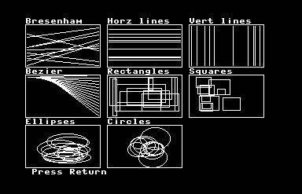
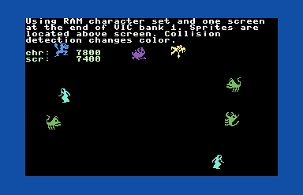

C3L (C128 CP/M C library) is an API based on the C89 standard, designed to facilitate access to C128 specific features within the CP/M environment.
The library provides an abstraction layer for VDC (Video Display Controller) and VIC (Video Interface Chip) common data and functions. 

A noteworthy advantage of this approach is the ability to dynamically set the target display (VIC, VDC, or virtual screen) during runtime. Initialization
involves simply specifying the desired display chip or utilizing both simultaneously. The VIC offers a feature where the PETSCII character
ROM can be utilized without any translation concerns. In the event of switching to the ASCII character set (the default for CP/M), only a single,
straightforward change is required. Additionally, the library encompasses CIA (Complex Interface Adapter) and SID (Sound Interface Device) functions to provide
comprehensive functionality.

Initially conceived as a pure C library, C3L has incorporated Z80 assembler code in specific areas where performance issues arise, such as accessing VIC color memory
through Z80 IN/OUT instructions. VIC and VDC parity has been achived for high performance text and bit mapped graphics eliminating chip-specific code.
This will enable developers to write programs capable of utilizing either chip without necessitating modifications to the codebase.

Comparing the [console](https://github.com/sgjava/c3l/blob/main/c3l/console.h) printCon 
and to C printf (using 80 character line for 23 lines):

<table>
<tr><th>VIC</th><th>VDC</th></tr>
<tr><td>


| Function        | MS per line | CPS   |
| :---            |        ---: | ---:  |
| printf          | 661         | 121   |
| scroll          | 100         | 9600  |
| printCon        | 37          | 2162  |
| scrollCon       | 29          | 33103 |
| printCon color  | 43          | 1860  |
| scrollCon color | 81          | 11851 |

</td><td>

| Function        | MS per line | CPS    |
| :---            |        ---: | ---:   |
| printf          | 453         | 176    |
| scroll          | 26          | 73846  |
| printCon        | 36          | 2222   |
| scrollCon       | 13          | 147692 |
| printCon color  | 40          | 2000   |
| scrollCon color | 18          | 106666 |

</td></tr> </table>

So from this you can see VDC printCon is 12 times faster and VIC printCon is 18 times faster than 
standard CP/M output (C printf). See [textperf.c](https://github.com/sgjava/c3l/blob/main/src/demo/textperf.c).

## Running demos
If you have VICE already setup you can run the demo applications using the [disk images](https://github.com/sgjava/c3l/tree/master/disks).
* `x128 -80col`
* In VICE configure drives
* Boot boot.d71 as device 8
* Attach demo.d71 as device 9
* Do a hard reset.
* `b`:
* `dualcon`
* To list all the demos just `dir *.com`

## Set up development environment
I have optimized the development process by implementing several changes. Firstly, I would like to inform you that I no longer provide support for native hardware and VICE.
However, if you are determined to use these tools, you can proceed with them at your own discretion.

To enhance efficiency and standardize the development environment, I have adopted the following tools: Ubuntu VM, Eclipse CDT, DOSBox, MyZ80, and ctools.
This combination offers the most expedient approach for C development on the C128 CP/M platform. It is worth noting that you can also adapt this framework
for your personal projects unrelated to C3L.

Within the "~/eclipse-workspace/c3l/build" directory, you will find a file called "makedisk.sh." This script serves the purpose of importing source code directly from the Eclipse workspace.
Additionally, it builds the C3L library, compiles demos, exports them, and ultimately creates a new d71 disk.

### Build [VICE](http://vice-emu.sourceforge.net) on Ubuntu 22.04 x86_64.
* `sudo apt install build-essential autoconf git libgtk-3-dev libvte-2.91-dev libjpeg-dev libpng-dev libgif-dev libtiff-dev libxaw7-dev libxxf86vm-dev libaudio-dev libasound2-dev libpulse-dev libreadline-dev libudev-dev libusb-1.0-0-dev flex bison dos2unix xa65 libglew-dev texlive-full`
* `cd`
* `git clone --depth 1 https://github.com/VICE-Team/svn-mirror`
* `cd svn-mirror/vice`
* `./autogen.sh`
* `./configure`
* `make -j$(getconf _NPROCESSORS_ONLN)`
* `sudo make install`
* `x128 -80col`

### Build ctools
* `cd`
* `git clone https://github.com/mist64/ctools`
* `cd ctools/src`
* `make`
* `make install`
* `sudo cp ../bin/* /usr/local/bin/.`

### Install DOSBox
This is needed to run MyZ80. In essance you are running a Ubuntu VM that is running a DOS emulator that is running a Z80 emulator.
Talk about a Russian doll, but it works nicely. C: is mounted to `~/myz80` and D: is 
mounted to `~/eclipse-workspace/c3l`.
* `sudo apt install dosbox`
* Run DOSBox and close it to create configuration file.
    * `dosbox`
* `nano ~/.dosbox/dosbox*.conf`
    * [sdl] section change
    `usescancodes=false`
    * [cpu] section change
    `cycles=max`
    * [autoexec] section add    
    ```
    mount c ~/myz80
    del c:\tmp\*.*
    mount d ~/eclipse-workspace/c3l
    c:
    myz80
    exit
### Install MyZ80

Just extract [myz80.zip](https://github.com/sgjava/c3l/tree/master/myz80) to your user's home dir. This is preconfigured with ZPM 3 and Hi-Tech C on A0. ~/myz80/PROFILE.SUB is the file auto submitted when the OS starts. You can modify this and import to A0 if needed. I left Drives C0 and D0 empty, so you can do what you want there. Drive 
B0 is used for source and binaries (COM files).

Install [Eclipse](https://www.eclipse.org/downloads).

You can use the installer to install C/C++ package with JRE already built in. Or you can install JDK and Eclipse. Just make sure you install CDT from the Eclipse Marketplace. Use the default `~/eclipse-workspace` for your workspace since everything is configured to work off that path.
While you cannot build the project in Eclipse it does syntax checking, refactoring, etc. It's way more advanced than anything on CP/M or DOS to edit a project of this size.

## Building

* `cd ~/eclipse-workspace/c3l/build`
* `./makedisk.sh`
COM files are exported to `~/myz80/tmp` and disk image is created at `~/eclipse-workspace/c3l/disks/demo.d71`. If a COM file is 0 bytes that means there was a build error for that program. If all programs are 0 length then you probably broke the library code.

## Programming considerations
* No range checks are performed by most functions for performance sake. It is
incumbent upon the programmer to handle range checks. If you go out of range
and corrupt the program or OS memory it will most likely lock the machine.
* If the linker gives an "Undefined symbol" message for some symbol which you know
nothing about, it is possible that it is a library routine which was not found
during the library search due to incorrect library ordering.  In this case you
can search the library twice, e.g. for the standard library add a -LC to the end
of the C command line, or -LF for the floating library.  If you have specified
the library by name simply repeat its name.

## High performance character mode

 

[Screen](https://github.com/sgjava/c3l/blob/main/c3l/screen.h) provides an 
abstraction that blows the doors off standard CP/M since it doesn't rely on MMU bank 
switching. If you do not use color printing it's even faster. A common color scheme 
is used and mapped by the various functions. This allows portability between VIC and 
VDC. Of course all of these settings are mutable at runtime.

#### Features
* Use ROM character set at 0x1800 for the smallest memory footprint (VIC)
* Fast print uses existing background color
* Fast color printing too
* PETSCII print functions convert from ASCII strings to PETSCII
* Custom character sets (can be copied from VDC or loaded from disk)
* Scroll any area of screen

If your app requires more of a console abstraction then use [console](https://github.com/sgjava/c3l/blob/main/c3l/console.h).
It operates like a normal console keeping track of the cursor and scrolling. There 
is also a print function that allows word wrapping.

#### Features
* Basic cursor (defaults to off)
* Fast print uses existing background color
* Fast color printing too
* Fast word wrap printing
* Automatic scrolling

## High performance bitmap graphics

 

[bitmap](https://github.com/sgjava/c3l/blob/main/c3l/bitmap.h) provides an 
abstraction for common graphice functions.

#### Features
* Set and clear pixel functions
* Fast color and bitmap clearing
* All drawing functions can set or clear pixels
* Optimized line drawing uses accelerated horizontal and vertical line functions
before using Bresenham's algorithm
* Rectangle uses optimized horizontal and vertical line functions
* Square (aspect ratio correct)
* Bézier curve
* Ellipse
* Circle (aspect ratio correct)
* Use existing character set to print to bitmap

## 8564/8566 VIC-IIe



### Features
* Easy to configure VIC mode and memory layout
* Character and bitmap mode options galore
* Sprites

### VIC memory management in CP/M
By default CP/M uses the VIC in MMU bank 0. This makes it difficult to access
from your CP/M program because the TPA is in bank 1. You could try to switch
banks like CP/M does, but this is very inefficient. Plus there is very little
free RAM in bank 0 that you could leverage. For C3L programs MMU bank 1 is
used and your program manages the VIC's memory.

You can use [allocVicMem()](https://github.com/sgjava/c3l/blob/main/src/vicam.c)
function to handle reserving memory for the VIC and
protect it from the running program. There are several configurations you can
use based on program size and VIC features you want to use. The simplest
configuration is to have your program and VIC memory in VIC bank 0 with
allocVicMem(0). With this configuration your program can reside from
0x100-0x2fff (almost 8K) and VIC memory is used starting at 0x3000 for character
set and 0x3800 for first screen. 0x1000-0x1fff is viewed by the VIC as
character ROM, but your program can use this memory, so it's not wasted.

allocVicMem() reserves a contiguous block of memory, thus allocVicMem(1) reserves
VIC bank 0 and VIC bank 1. VIC bank 3 is in the gray area since some of it is
reserved for CP/M. It's a good idea to allocate memory in bank 3 manually if
you have a large program. Remember to free() memory allocated by allocVicMem()
when you are done with the VIC.

### Return to CP/M mode
You should return to CP/M like nothing happened to the VIC.

### Limitations
As I mentioned above 0x1000 is always read by the VIC as character ROM. Your
program will still use this memory normally. See [vicspr](https://github.com/sgjava/c3l/blob/main/src/demo/vicspr.c)
for an example of using the ROM character set and the ASCII to PETSCII translation
of printVicPet.

### Character mode
I include everything you need to take control of character mode. I
also included PETSCII print functions, so you can use the ROM character set
at 0x1800. To keep things consistent I like to use the VDC's character set since
that's what you use in normal CP/M mode. You have to think a little different
using C3L since stdout is no longer visible. stdout still goes to the screen in
VIC bank 0, so that could be used for debugging, etc.

### Bitmap graphics
I put some thought in how to share the same graphics functions across the VIC
and VDC (DRY principle). In an OOP language like Java you'd just use an
interface and create various implementations. Since I'm using ANSI C I had to
go with function pointers. This basically allows runtime polymorphism, thus I
can set the pixel routines, etc. at runtime and share the graphics functions.

I took a fresh look at implementing lines, rectangles, ellipses and circles.
setVicPix sets a pixel and clearVicPix clears a pixels. I added color to
the graphics function to tell it to set or clear pixels (for monochrome). This is pretty cool,
since you can easily erase parts of your drawing using the same parameters except
the last one called setPix. Set color to 1 to set and 0 to clear pixels.

I optimized drawLine by detecting horizontal and vertical lines. drawLineH
can draw horizontal lines about 15x faster than Bresenham's algorithm based on
the bitmap memory layout and not having to read/write the pixel byte 8 times like
setPix and clearPix. drawLineV is optimized also, but not nearly as much
as drawLineH. You can still call drawLineH and drawLineV directly as needed.

Enough bitmap graphic basics are provided to build applications that can graph
data, build out game screens, annotate with text that can have unique foreground
and background colors, etc.

## 6581/8580 SID
All the required functions are there to drive the SID.

### Features
* Clear SID
* Set master volume
* Set envelopes
* Set attack/release cycles
* Set pulse wave

## Keyboard scan and decode
The 8502 is responsible for most of the low-level I/O functions in CP/M mode and
the key scan routine is no exception. The whole idea behind C3L is to stay in
native Z80 mode as much as possible. This required writing low level key scan
and decode functions. [Keyboard Scan](https://sites.google.com/site/h2obsession/CBM/C128/keyboard-scan)
describes the concept. You end up with complex weirdness like the shift and
another key being on the scan row. The formula is 255-2^k1-2^k2, but I
calculated the values for the left and right shift using a lookup table, so no
calculation or bit fiddling is needed with these combinations.

[getKey](https://github.com/sgjava/c3l/blob/main/src/ciagk.c)
allows you to read a single key row. This can be used for video games or other
time sensitive applications. In order to read standard and extended rows requires
18 out and 16 in operations. getKey only requires 2 out and 1 in operations. Plus
you do not need to decode the row saving that time as well.

[readLineCon](https://github.com/sgjava/c3l/blob/main/src/conrl.c)
is a simple line editor that takes advantage of screen memory to allow input
from the keyboard to be displayed and saved. Debounce logic makes sure the input
is smooth while still allowing for auto repeat. Only Backspace is allowed to
edit the line. Insert and delete can be added later. 

### Features
* Read single row for performance
* Read all standard and extended rows at once
* Decode key press as ASCII including shifted characters
* Simple line editor
* CP/M key scan routine disabled for performance

### Limitations
* Shift lock not accessible in Z80 mode
* Polling frequency is important, so long running processes between key presses
may cause missed key strokes.

## DS12C887 Real Time Clock

I have been spoiled using NodeMCU (ESP8266) micro controllers. NodeMcu has a
NTP module for getting network time. I thought why not try a RTC on the C128?
[DS12C887 - Real Time Clock for C64/128](https://github.com/ytmytm/c64-ds12c887.git)
covers how it's done on a real C128.
[DS12887 RTC INTERFACING](http://what-when-how.com/8051-microcontroller/ds12887-rtc-interfacing)
gives you more detailed information on how to program the DS12C887.

### Features
* Read and write data register.
* Get time in hh:mm:ss format.
* Get date in mm/dd/yyyy format.
